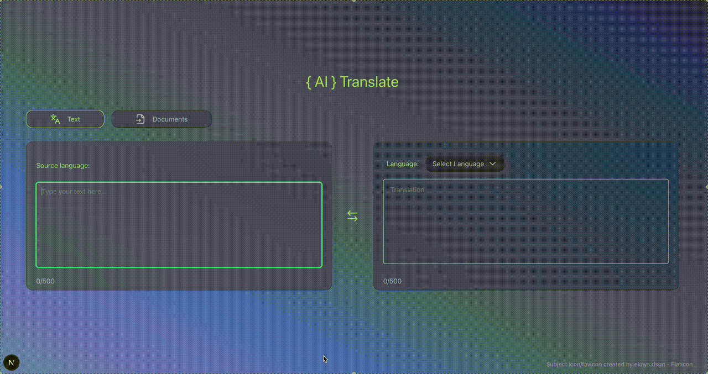

# &#123; AI &#125; Translate

&#123; AI &#125; Translate is a web application that leverages AI to provide seamless text translation. It features a clean, intuitive interface for translating text between various languages, with an upcoming document translation feature.

## Features

- **Text Translation**: Translate text instantly between a wide range of languages.
- **Automatic Language Detection**: Automatically detects the source language of the input text.
- **Swap Languages**: Easily swap the source and target languages for quick re-translation.
- **Responsive Design**: A user-friendly interface that adapts to different screen sizes.
- **Character Limit**: Input text is limited to 500 characters.
- **Toasts Notifications**: Provides toast notifications for translation status (loading, success, error).
- **Document Translation (Upcoming)**: A dedicated section for future document translation functionality.

---



---

## Installation and Usage

To get started with &#123; AI &#125; Translate, follow these steps:

1.  **Clone the repository**:

    ```bash
    git clone https://github.com/FCimendere/translation_ai_app.git
    cd translation_ai_app
    ```

2.  **Install dependencies**:

    ```bash
    pnpm install
    ```

3.  **Set up environment variables**:
    Create a `.env.local` file in the root directory and add your AI model API key:

    ```
    OPENAI_API_KEY=your_openai_api_key
    # or
    GOOGLE_API_KEY=your_google_api_key
    ```

    _Note: The `route.ts` file currently uses `openai("gpt-4.1-mini-2025-04-14")` as the default model. If you wish to use Google Gemini, uncomment the `model: google("models/gemini-2.0-flash-exp")` line and comment out the OpenAI model line in `route.ts`._

4.  **Run the development server**:

    ```bash
    pnpm run dev

    ```

    Open [http://localhost:3000](http://localhost:3000) in your browser to see the application.

5.  **Build for production**:

    ```bash
    pnpm run build
    ```

6.  **Start production server**:
    ```bash
    pnpm run start
    ```

---

## How to Use

1.  **Type Text**: Enter the text you wish to translate into the "Type your text here..." textarea on the left.
2.  **Select Target Language**: Use the dropdown menu in the "Translation" card on the right to select your desired target language. The translation will automatically appear.
3.  **Swap Languages**: Click the circular swap icon in the middle to interchange the content of the "Type your text here..." and "Translation" text areas, along with their respective languages.
4.  **Document Tab**: The "Documents" tab is a placeholder for a future feature.

---

## Project Structure

```
.
└── app
├── api
│ ├── translate
│ │ ├── components
│ │ │ ├── button.tsx
│ │ │ ├── Dropdown
│ │ │ │ └── Dropdown.tsx
│ │ │ ├── DropdownButton
│ │ │ │ └── DropdownButton.tsx
│ │ │ ├── DropdownContent
│ │ │ │ └── DropdownContent.tsx
│ │ │ ├── DropdownItem
│ │ │ │ └── DropdownItem.tsx
│ │ │ ├── switchIcon.tsx
│ │ │ ├── toTranslate.tsx
│ │ │ └── translation.tsx
│ │ └── route.ts
│ └── utils
│ └── languages.ts
├── favicon.ico
├── globals.css
├── layout.tsx
└── page.tsx

```

---

## License

MIT © Fulya Cimendere

---

## Credits

- Icons by [Lucide](https://lucide.dev/).
- Subject icon/favicon created by [ekays.dsgn - Flaticon](https://www.flaticon.com/free-icons/subject).
